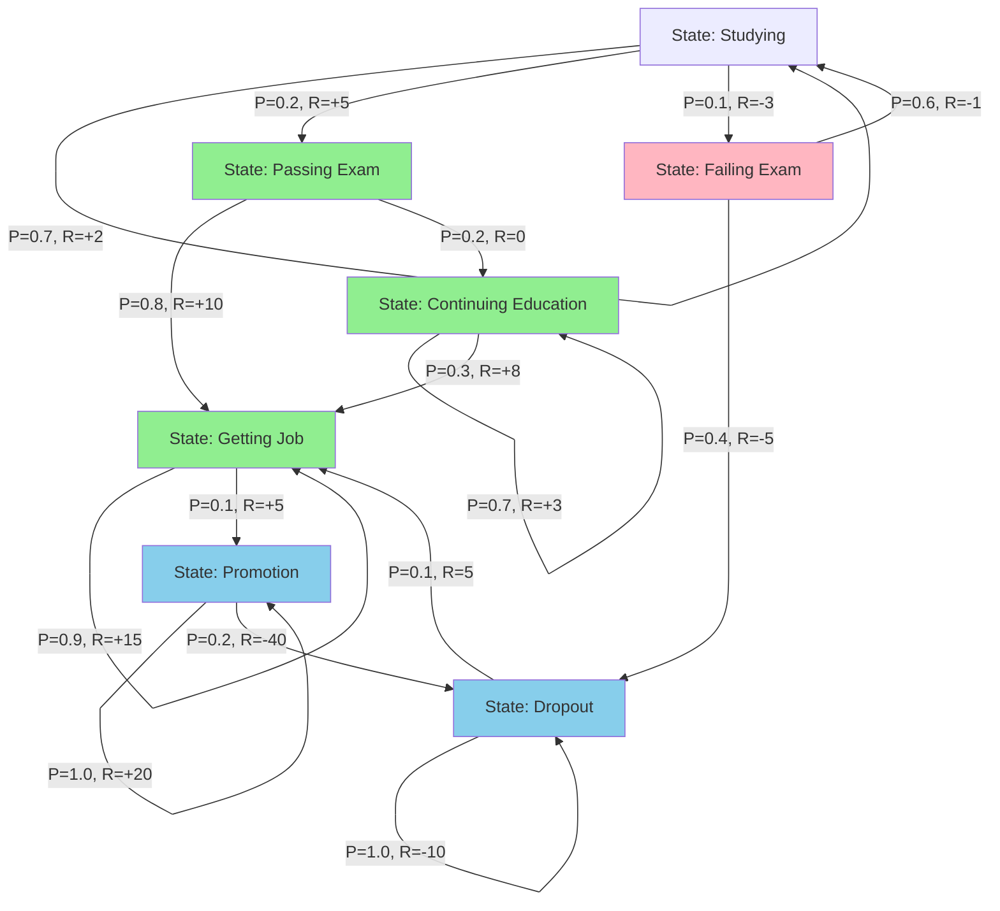
```mermaid
graph TD
    S1[State: Studying] --> |P=0.7, R=+2| S1
    S1 --> |P=0.2, R=+5| S2[State: Passing Exam]
    S1 --> |P=0.1, R=-3| S3[State: Failing Exam]
    
    S2 --> |P=0.8, R=+10| S4[State: Getting Job]
    S2 --> |P=0.2, R=0| S5[State: Continuing Education]
    
    S3 --> |P=0.6, R=-1| S1
    S3 --> |P=0.4, R=-5| S6[State: Dropout]
    
    S4 --> |P=0.9, R=+15| S4
    S4 --> |P=0.1, R=+5| S7[State: Promotion]
    
    S5 --> |P=0.7, R=+3| S5
    S5 --> |P=0.3, R=+8| S4
    
    S6 --> |P=1.0, R=-10| S6
    S6 --> |P=0.1, R=5| S4
    
    S7 --> |P=1.0, R=+20| S7
    S7 --> |P=0.2, R=-40| S6
    
    classDef positive fill:#90EE90
    classDef negative fill:#FFB6C1
    classDef terminal fill:#87CEEB
    
    class S2,S4,S5,S7 positive
    class S3,S6 negative
    class S6,S7 terminal
```

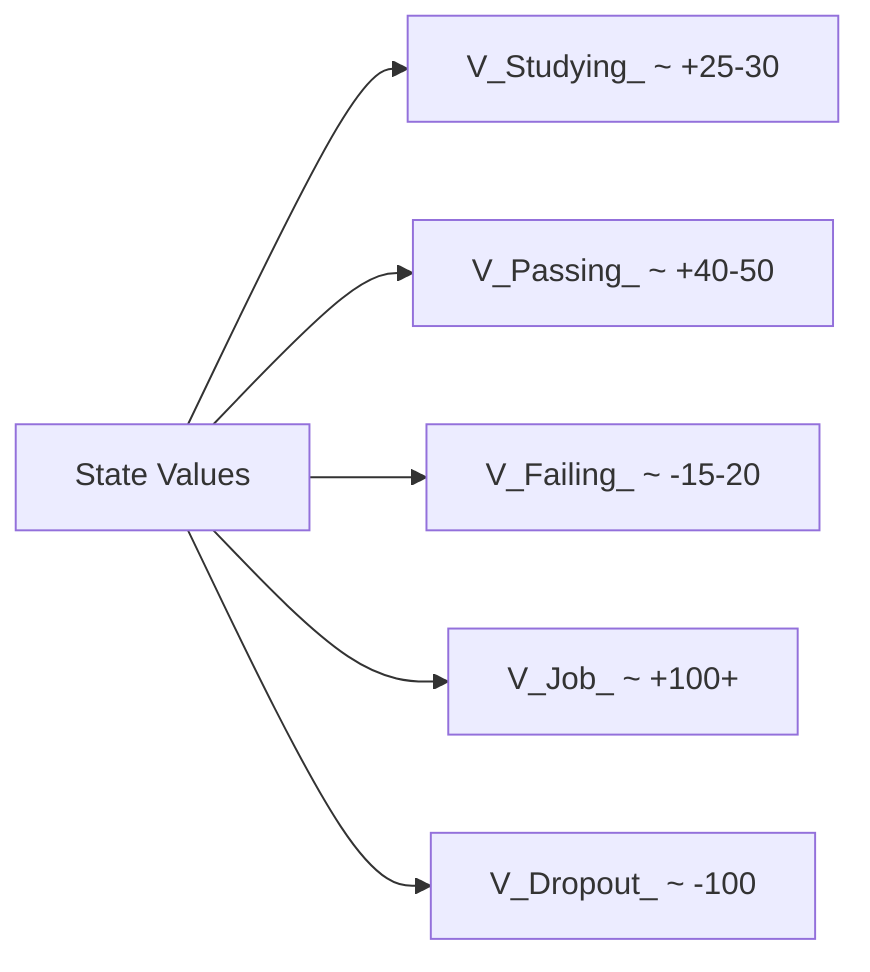
```mermaid
graph LR
    A[State Values] --> B[V_Studying_ ~ +25-30]
    A --> C[V_Passing_ ~ +40-50]
    A --> D[V_Failing_ ~ -15-20]
    A --> E[V_Job_ ~ +100+]
    A --> F[V_Dropout_ ~ -100]
```

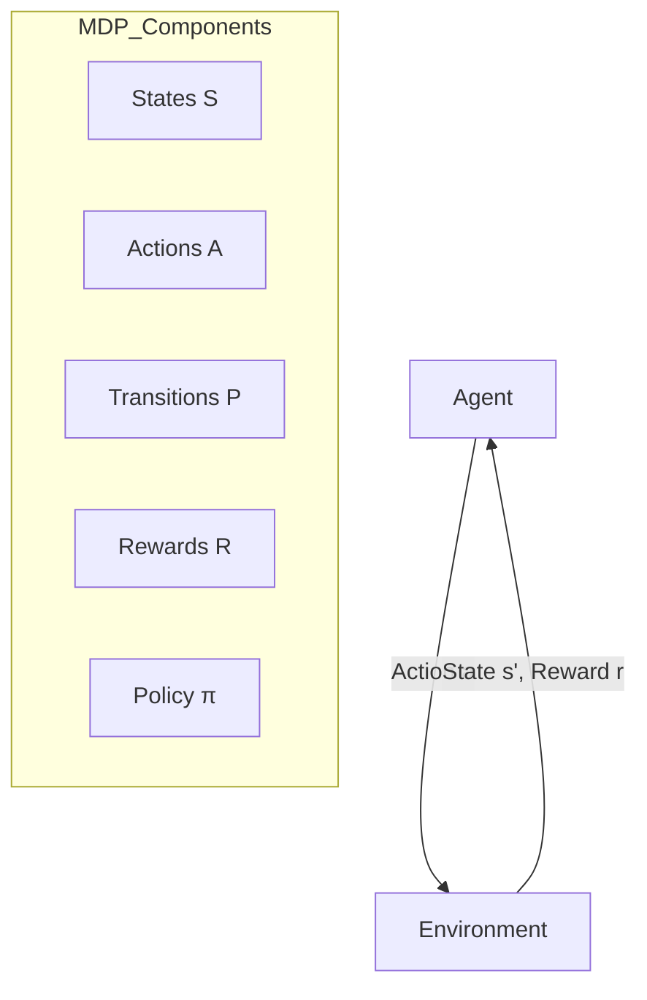
```mermaid
graph TD
    A[Agent] -->|Action a| B[Environment]
    B -->|State s', Reward r| A
    
    subgraph MDP_Components
        C[States S]
        D[Actions A]
        E[Transitions P]
        F[Rewards R]
        G[Policy π]
    end
```

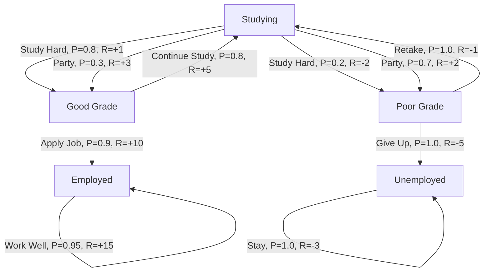
```mermaid
graph TD
    S1[Studying] -->|Study Hard, P=0.8, R=+1| S2[Good Grade]
    S1 -->|Study Hard, P=0.2, R=-2| S3[Poor Grade]
    S1 -->|Party, P=0.3, R=+3| S2
    S1 -->|Party, P=0.7, R=+2| S3
    
    S2 -->|Apply Job, P=0.9, R=+10| S4[Employed]
    S2 -->|Continue Study, P=0.8, R=+5| S1
    
    S3 -->|Retake, P=1.0, R=-1| S1
    S3 -->|Give Up, P=1.0, R=-5| S5[Unemployed]
    
    S4 -->|Work Well, P=0.95, R=+15| S4
    S5 -->|Stay, P=1.0, R=-3| S5
    
    classDef action fill:#FFE4B5
    classDef state fill:#E6E6FA
```

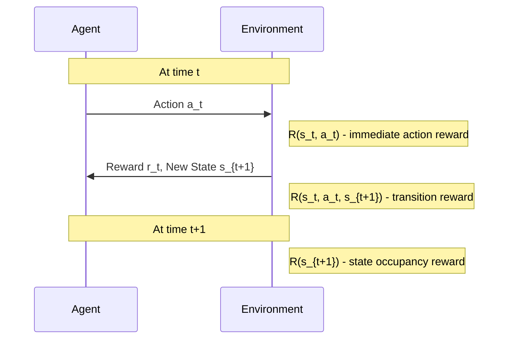
```mermaid
sequenceDiagram
    participant Agent
    participant Environment
    
    Note over Agent, Environment: At time t
    Agent->>Environment: Action a_t
    Note right of Environment: R(s_t, a_t) - immediate action reward
    Environment->>Agent: Reward r_t, New State s_{t+1}
    Note right of Environment: R(s_t, a_t, s_{t+1}) - transition reward
    Note over Agent, Environment: At time t+1
    Note right of Environment: R(s_{t+1}) - state occupancy reward
```

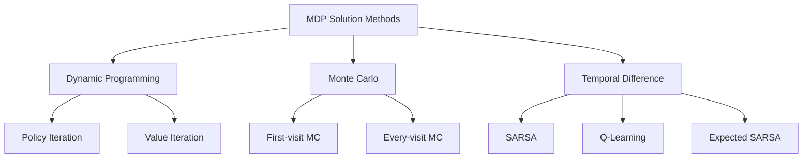
```mermaid
graph TD
    A[MDP Solution Methods] --> B[Dynamic Programming]
    A --> C[Monte Carlo]
    A --> D[Temporal Difference]
    
    B --> B1[Policy Iteration]
    B --> B2[Value Iteration]
    
    C --> C1[First-visit MC]
    C --> C2[Every-visit MC]
    
    D --> D1[SARSA]
    D --> D2[Q-Learning]
    D --> D3[Expected SARSA]
```

```mermaid
graph TD
    S1[Studying] -->|Study Hard, P=0.8, R=+1| S2[Good Grade]
    S1 -->|Study Hard, P=0.2, R=-2| S3[Poor Grade]
    S1 -->|Party, P=0.3, R=+3| S2
    S1 -->|Party, P=0.7, R=+2| S3
    
    S2 -->|Apply Job, P=0.9, R=+10| S4[Employed]
    S2 -->|Continue Study, P=0.8, R=+5| S1
    
    S3 -->|Retake, P=1.0, R=-1| S1
    S3 -->|Give Up, P=1.0, R=-5| S5[Unemployed]
    
    S4 -->|Work Well, P=0.95, R=+15| S4
    S5 -->|Stay, P=1.0, R=-3| S5
    
    classDef action fill:#FFE4B5
    classDef state fill:#E6E6FA
```

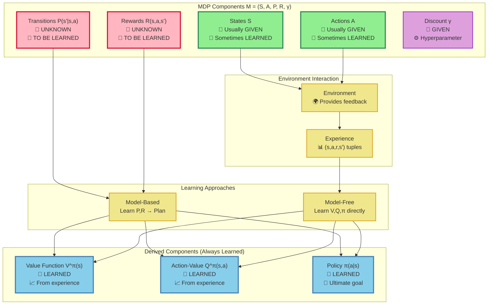
```mermaid
graph TD
    subgraph "MDP Components M = (S, A, P, R, γ)"
        S["States S<br/>📍 Usually GIVEN<br/>🎯 Sometimes LEARNED"]
        A["Actions A<br/>📍 Usually GIVEN<br/>🎯 Sometimes LEARNED"]
        P["Transitions P(s'|s,a)<br/>🔴 UNKNOWN<br/>🎯 TO BE LEARNED"]
        R["Rewards R(s,a,s')<br/>🔴 UNKNOWN<br/>🎯 TO BE LEARNED"]
        G["Discount γ<br/>📍 GIVEN<br/>⚙️ Hyperparameter"]
    end
    
    subgraph "Derived Components (Always Learned)"
        V["Value Function V^π(s)<br/>🎯 LEARNED<br/>📈 From experience"]
        Q["Action-Value Q^π(s,a)<br/>🎯 LEARNED<br/>📈 From experience"]
        PI["Policy π(a|s)<br/>🎯 LEARNED<br/>🎯 Ultimate goal"]
    end
    
    subgraph "Learning Approaches"
        MB["Model-Based<br/>Learn P,R → Plan"]
        MF["Model-Free<br/>Learn V,Q,π directly"]
    end
    
    subgraph "Environment Interaction"
        ENV["Environment<br/>🌍 Provides feedback"]
        EXP["Experience<br/>📊 (s,a,r,s') tuples"]
    end
    
    %% Connections
    P --> MB
    R --> MB
    MB --> V
    MB --> Q
    MB --> PI
    
    EXP --> MF
    MF --> V
    MF --> Q
    MF --> PI
    
    ENV --> EXP
    S --> ENV
    A --> ENV
    
    %% Styling
    classDef given fill:#90EE90,stroke:#2E8B57,stroke-width:3px
    classDef unknown fill:#FFB6C1,stroke:#DC143C,stroke-width:3px
    classDef learned fill:#87CEEB,stroke:#4682B4,stroke-width:3px
    classDef hyperParam fill:#DDA0DD,stroke:#9932CC,stroke-width:2px
    classDef approach fill:#F0E68C,stroke:#DAA520,stroke-width:2px
    
    class S,A given
    class P,R unknown
    class V,Q,PI learned
    class G hyperParam
    class MB,MF,ENV,EXP approach
```

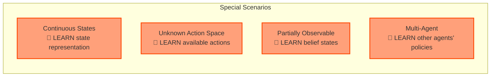
```mermaid
graph LR
    subgraph "Special Scenarios"
        A1["Continuous States<br/>🎯 LEARN state representation"]
        A2["Unknown Action Space<br/>🎯 LEARN available actions"]
        A3["Partially Observable<br/>🎯 LEARN belief states"]
        A4["Multi-Agent<br/>🎯 LEARN other agents' policies"]
    end
    
    classDef special fill:#FFA07A,stroke:#FF4500,stroke-width:2px
    class A1,A2,A3,A4 special
```

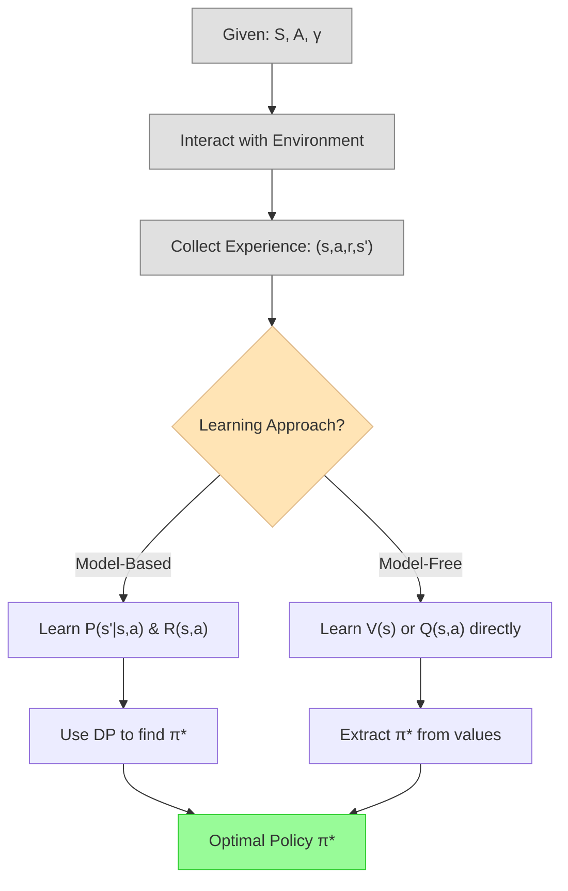
```mermaid
flowchart TD
    A["Given: S, A, γ"] --> B["Interact with Environment"]
    B --> C["Collect Experience: (s,a,r,s')"]
    C --> D{"Learning Approach?"}
    
    D -->|Model-Based| E["Learn P(s'|s,a) & R(s,a)"]
    D -->|Model-Free| F["Learn V(s) or Q(s,a) directly"]
    
    E --> G["Use DP to find π*"]
    F --> H["Extract π* from values"]
    
    G --> I["Optimal Policy π*"]
    H --> I
    
    classDef process fill:#E0E0E0,stroke:#808080
    classDef decision fill:#FFE4B5,stroke:#DEB887
    classDef result fill:#98FB98,stroke:#32CD32
    
    class A,B,C process
    class D decision
    class I result
```

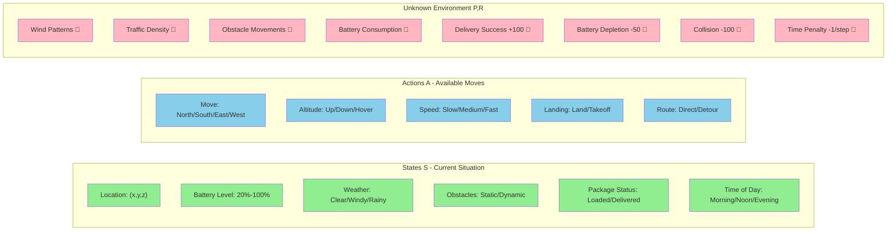
```mermaid
graph LR
    subgraph "States S - Current Situation"
        S1["Location: (x,y,z)"]
        S2["Battery Level: 20%-100%"]
        S3["Weather: Clear/Windy/Rainy"]
        S4[Obstacles: Static/Dynamic]
        S5[Package Status: Loaded/Delivered]
        S6[Time of Day: Morning/Noon/Evening]
    end
    
    subgraph "Actions A - Available Moves"
        A1[Move: North/South/East/West]
        A2[Altitude: Up/Down/Hover]
        A3[Speed: Slow/Medium/Fast]
        A4[Landing: Land/Takeoff]
        A5[Route: Direct/Detour]
    end
    
    subgraph "Unknown Environment P,R"
        P1[Wind Patterns 🔴]
        P2[Traffic Density 🔴]
        P3[Obstacle Movements 🔴]
        P4[Battery Consumption 🔴]
        R1[Delivery Success +100 🔴]
        R2[Battery Depletion -50 🔴]
        R3[Collision -100 🔴]
        R4[Time Penalty -1/step 🔴]
    end
    
    classDef given fill:#90EE90
    classDef unknown fill:#FFB6C1
    classDef action fill:#87CEEB
    
    class S1,S2,S3,S4,S5,S6 given
    class A1,A2,A3,A4,A5 action
    class P1,P2,P3,P4,R1,R2,R3,R4 unknown
```

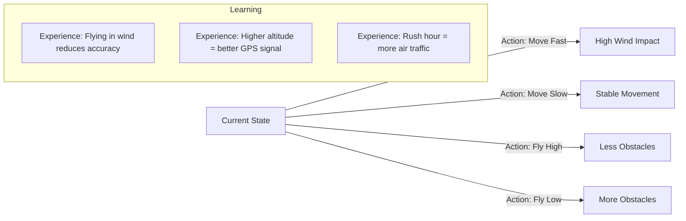
```mermaid
graph LR
    A[Current State] -->|Action: Move Fast| B[High Wind Impact]
    A -->|Action: Move Slow| C[Stable Movement]
    A -->|Action: Fly High| D[Less Obstacles]
    A -->|Action: Fly Low| E[More Obstacles]
    
    subgraph Learning
        F[Experience: Flying in wind reduces accuracy]
        G[Experience: Higher altitude = better GPS signal]
        H[Experience: Rush hour = more air traffic]
    end
```

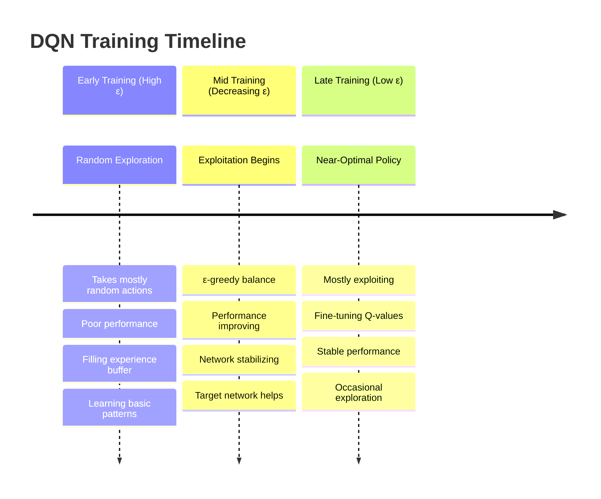
```mermaid
timeline
    title DQN Training Timeline
    
    section Early Training (High ε)
        Random Exploration : Takes mostly random actions
                          : Poor performance
                          : Filling experience buffer
                          : Learning basic patterns
    
    section Mid Training (Decreasing ε)
        Exploitation Begins : ε-greedy balance
                           : Performance improving
                           : Network stabilizing
                           : Target network helps
    
    section Late Training (Low ε)
        Near-Optimal Policy : Mostly exploiting
                           : Fine-tuning Q-values
                           : Stable performance
                           : Occasional exploration
```