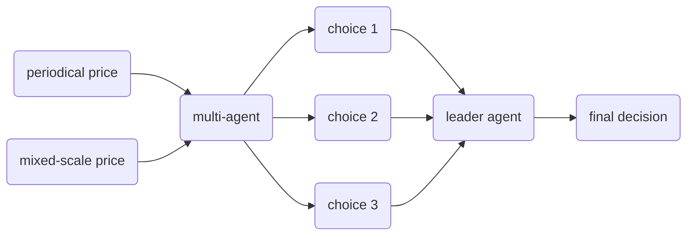

<!-- # Markdown Cases

## Headers

```markdown
# H1
## H2
### H3
```

## Emphasis

*Italic*  
**Bold**  
***Bold Italic***

## Lists

- Unordered item
- Another item

1. Ordered item
2. Second item

## Links

[GitHub](https://github.com)

## Images


## Code

Inline: `code`  
Block:
```python
print("Hello, Markdown!")
```

## Blockquote

> This is a quote.

## Table

| Name   | Value |
|--------|-------|
| Foo    | 123   |
| Bar    | 456   |

## Task List

- [x] Task 1
- [ ] Task 2 -->

## Agents (Exclusive)
- agent1 $\longleftarrow$ factor investing
    - gpt4o
- agent2 $\longleftarrow$ mean regression
    - deepseek-reasoning
- ...
- agentn $\longleftarrow$ hedging
    - claude

## Support data (Shared)
- RAG $\longleftarrow$ market intelligence
    - news
    - media
    - important event
- tool-call $\longleftarrow$ financial tool
    - calculation
- LLM feature $\longleftarrow$ reasoning / CoT / VectorDB
- Base-model $\longleftarrow$ local deployment

## Multiagent collaboration
